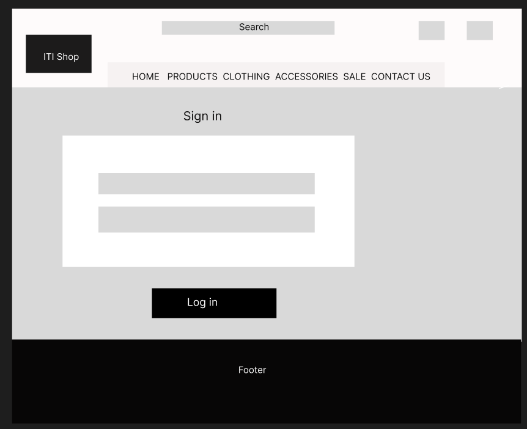

# ITI Shop

 

#### Welcome to ITI Shop ! 

ITI Shop is an online clothing store offering a wide variety of fashion items. The website is easy to navigate, allowing customers to browse and purchase products quickly. With features like product reviews and wishlists, ITI Shop provides a smooth and enjoyable shopping experience. The site is designed with security in mind, ensuring that all transactions are safe and user information is protected.

## Table of Contents

### [UX](#ux)
- [The Strategy](#the-strategy)
- [Targeted Users](#targeted-users)
- [Site Goals](#site-goals)
- [Project Goals](#project-goals)

 ## [Agile Development](#agile-development)
  - [Project Board](#project-board)
  - [User Stories](#user-stories)

## [Wireframes](#wireframes)

### [Database Design](#database-design)

### [Main Plan](#main-plan)

### [Structure ](#structure)
- [Features](#features)
  - [Home Page](#home-page)
  - [Random Products Section](#)
  - [Newsletter Subscription Section](#)
  - [Footer](#footer)
  - [FAQ Page](#)
  - [Contact Page](#)
  - [Privacy Policy](#)
  - [Main Nav Menu](#)
  - [Restricted Pages](#restricted-pages)
  - [Product Filtration](#product-filtration)
  - [Search Bar](#search-bar)
  - [Sale Page](#sale-page)
  - [Product Details Page](#product-details-page)
  - [Wishlist Page](#wishlist-page)
  - [My Account Dropdown](#my-account-dropdown)
  - [User Sign Up Page](#user-sign-up-page)
  - [User Sign In Page](#user-sign-in-page)
  - [User Sign Out Page](#user-sign-out-page)
  - [User Profile Page](#user-profile-page)
  - [Shopping bag Page](#)
  - [Checkout Page](#checkout-page)
  - [Error 404 Page](#error-page)

### [Future Features](#future-features)

### [Design](#design)
- [Colour Scheme](#colour-scheme)
- [Typography](#typography)
- [Images](#images)

### [Business Model](#business-model)

### [Marketing Strategy](#marketing-strategy)
- [Social Media Marketing](#social-media-marketing)
- [Newsletter Marketing](#newsletter-marketing)
- [Search Engine Optimization (SEO)](#search-engine-optimization-seo)
  - [Keywords](#keywords)
  - [SiteMap](#sitemap)
  - [Robots](#robots)

### [Technologies](#technologies)
- [Languages Used](#languages-used)
- [Frameworks Used](#frameworks-used)
- [Libraries And Installed Packages](#libraries-and-installed-packages)
- [Tools and Resources](#tools-and-resources)

### [Testing](#testing)
- [Bugs](#bugs)

### [Credits](#credits)

### [Deployment](#deployment)

### [Acknowledgements](#acknowledgements)

## UX

### The Strategy

The primary goal of ITI shop is to provide an enjoyable shopping experience for users looking for fashionable and affordable clothing. The aim is to create an engaging platform that allows users to browse, purchase, and interact with products effortlessly, whether they are casual visitors, returning customers, or admin users managing the store.

### Targeted Users

#### First-time Users
   * These users are visiting the site for the first time and are able to view the products available, learn about the brand, and possibly make a purchase as a guest.
#### Registered Users
  * These users have an account on the site, enabling them to enjoy a more personalized shopping experience, such as saving items to a wishlist, reviewing products, and managing their user account.
#### Admin Users
  * These users manage the site by adding and editing products, overseeing orders, and handling customer inquiries.

### Site Goals

 * Offer a user-friendly interface with clear navigation and engaging content.
 * Encourage visitors to make purchases by providing an intuitive shopping experience.
 * Create a platform that encourages users to return through personalized experiences, including wishlist features,
 similar product recommendations , reviews etc.
 * Provide admins with straightforward tools to manage products, orders, and customer interactions effectively.

### Project Goals
 * Ensure the website is accessible and visually appealing on all devices, including desktops, tablets, and smartphones.
 * Develop functionalities such as user authentication, product browsing, shopping cart management, and a secure checkout process.
 * Introduce features like product reviews, similar and matching product suggestions, wishlist and newsletter subscriptions to enhance user engagement.
 * Build an easy-to-use admin interface that allows for efficient management of products, orders, and user communications.

## Agile Development

 The development of ITI Shop has followed Agile methodology, enabling continuous improvement and iterative development. User stories were created to define and prioritize the core functionalities needed for the site.

#### MoSCoW
For this project the MoSCoW technique, (Must have, Should have, Could have, Won't have) was used for planning User Stories.
This approach helped in identifying the most critical features needed to deliver a functional and user-friendly product, ensuring that key elements were developed first to provide the best possible user experience.

#### Kanban
To efficiently manage and visualize the project's progress,the Kanban system was implemented.

### Project Board

The full Project Board can be found [here](https://github.com/users/Lin2907/projects/5/views/1).

### User Stories
Based on the user stories, a detailed project implementation plan was created. You can review the user stories [here](https://github.com/Lin2907/ITI-Shop/issues?q=is%3Aissue+is%3Aclosed).

 

## Wireframes

<h4 style="display: inline;">Landing page</h4>

 

 

<h4 style="display: inline;">Product Page</h4>

 

 

<h4 style="display: inline;">Product Detail Page</h4>

 

 

<h4 style="display: inline;">Newsletter Page</h4>

 

 

<h4 style="display: inline;">Add a Review Page</h4>

 

 

<h4 style="display: inline;">Contact Us Page</h4>

 

 

<h4 style="display: inline;">Sign Up Page</h4>

 

 

<h4 style="display: inline;">Log in Page</h4>

 

 

<h4 style="display: inline;">Log out Page</h4>

 

 

<h4 style="display: inline;">Custom 404 Page</h4>

 

 

<h4 style="display: inline;">Custom 500 Page</h4>

 

## Database Design

### ERD - Entity Relationship Diagram

