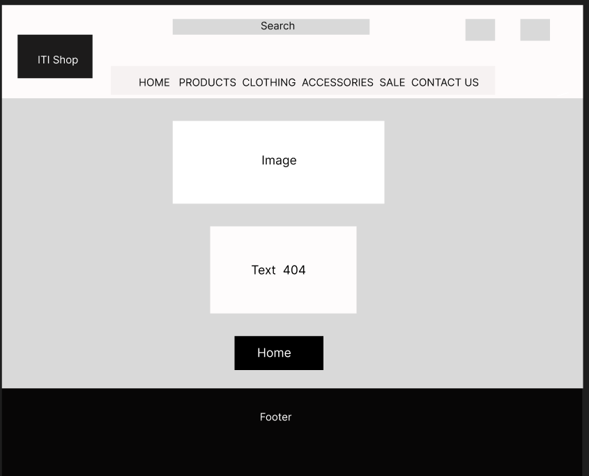
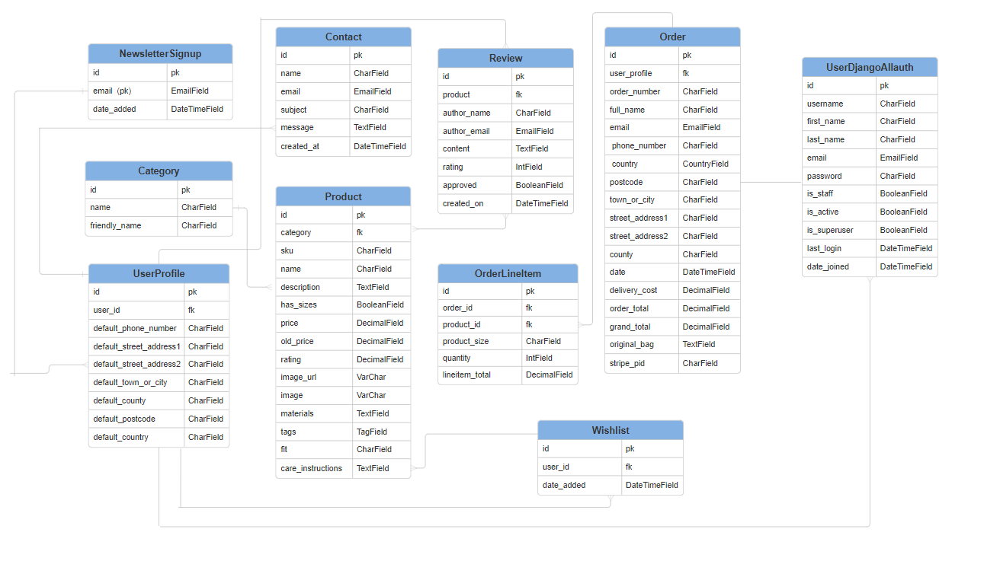
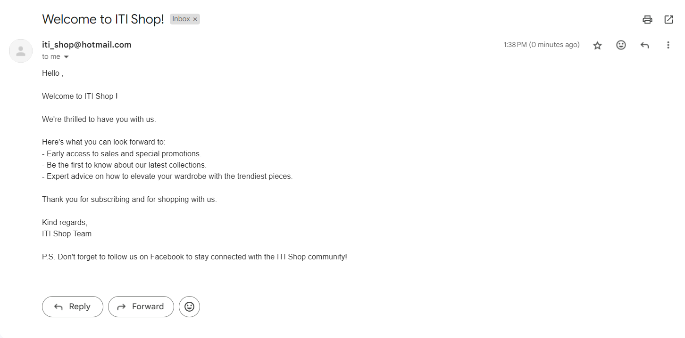
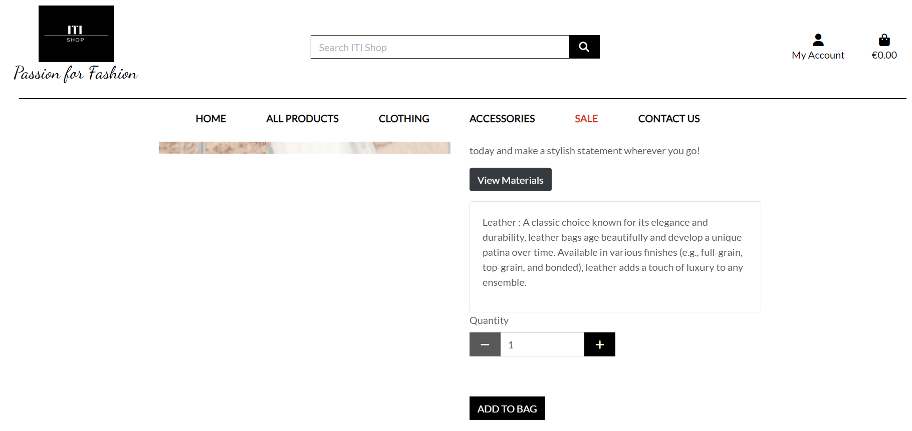
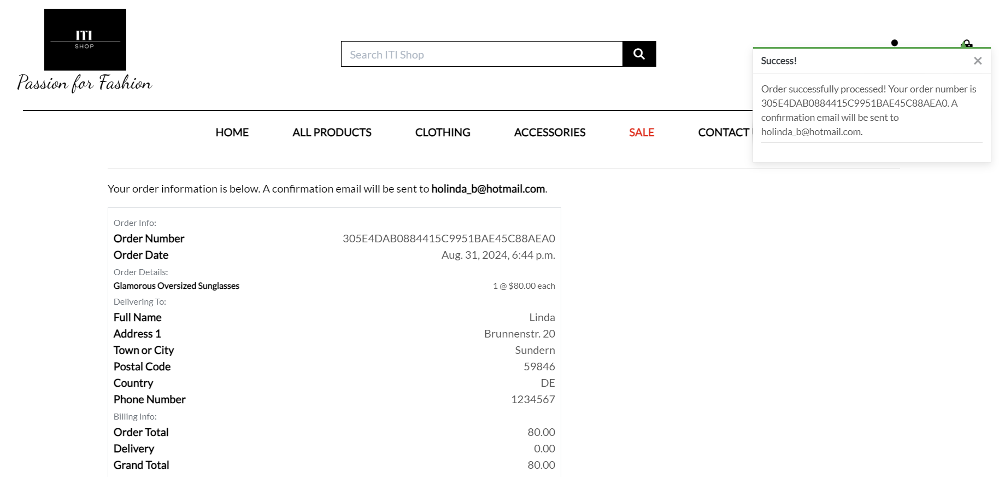
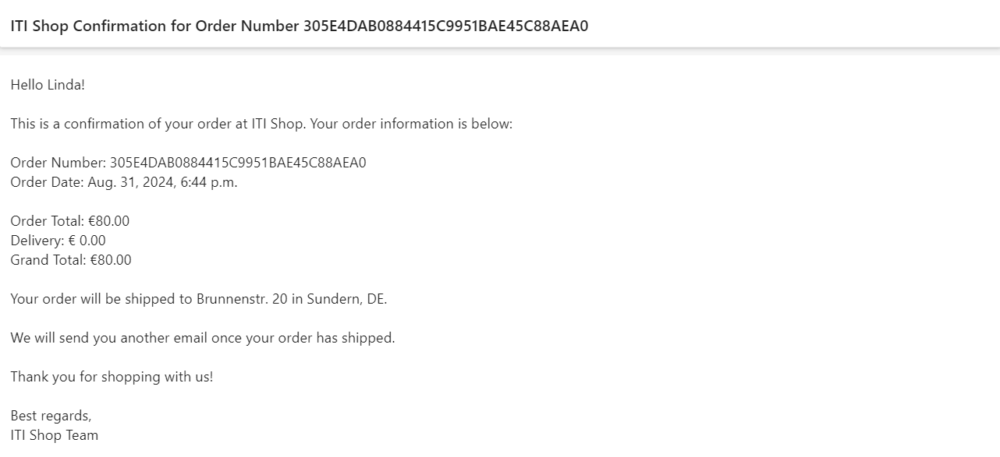

# ITI Shop

 

#### Welcome to ITI Shop ! 

ITI Shop is an online clothing store offering a wide variety of fashion items. The website is easy to navigate, allowing customers to browse and purchase products quickly. With features like product reviews and wishlists, ITI Shop provides a smooth and enjoyable shopping experience. The site is designed with security in mind, ensuring that all transactions are safe and user information is protected.

Live site [ITI Shop](https://iti-shop-15bc9a913a6f.herokuapp.com/).

## Table of Contents

[UX](#ux)
- [The Strategy](#the-strategy)
- [Targeted Users](#targeted-users)
- [Site Goals](#site-goals)
- [Project Goals](#project-goals)

 [Agile Development](#agile-development)
  - [Project Board](#project-board)
  - [User Stories](#user-stories)

[Wireframes](#wireframes)

[Database Design](#database-design)

[Features](#features)
  - [Home Page](#home-page)
  - [Random Products Section](#random-products-gallery)
  - [Newsletter Subscription Section](#newsletter-signup-form)
  - [Navigation](#navigation)
  - [Footer](#footer)
  - [All Products Page](#all-products-page)
  - [Product Detail Page](#product-detail-page)
  - [Clothing Page](#clothing-page)
  - [Accessories Page](#accessories-page)
  - [Sale Page](#sale-page)
  - [Contact Us Page](#contact-us-page)
  - [FAQ Page](#faq-page)
  - [Profile Page](#profile-page)
  - [Shopping Bag](#shopping-bag)
  - [Checkout Page](#checkout-page)
  - [Sign Up Page](#sign-up-page)
  - [Sign In Page](#sign-in)
  - [Sign Out Page](#sign-out)
  - [Product management Page](#product-management-page)
  - [Error 404 Page](#error-404-page)
  - [Privacy Policy](#)

[Futures left to implement](#features-left-to-implement)

[Design](#design)
- [Colour Scheme](#color-scheme)
- [Typography](#typography)

[Business Model](#bussines-model)

[Marketing](#marketing)
- [Social Media Marketing](#social-media-marketing)
- [Newsletter Marketing](#newsletter-marketing)
- [Search Engine Optimization (SEO)](#seo-search-engine-optimization)

[Technologies](#technologies)
- [Languages Used](#languages-used)
- [Frameworks Used](#frameworks-used)
- [Libraries And Installed Packages](#libraries-and-installed-packages)
- [Tools and Resources](#tools-and-resources)

[Testing](#testing)

[Credits](#credits)

[Deployment](#deployment)

[Acknowledgements](#acknowledgements)

## UX

### The Strategy

The primary goal of ITI shop is to provide an enjoyable shopping experience for users looking for fashionable and affordable clothing. The aim is to create an engaging platform that allows users to browse, purchase, and interact with products effortlessly, whether they are casual visitors, returning customers, or admin users managing the store.

### Targeted Users

#### First-time Users
   * These users are visiting the site for the first time and are able to view the products available, learn about the brand, and possibly make a purchase as a guest.
#### Registered Users
  * These users have an account on the site, enabling them to enjoy a more personalized shopping experience, such as saving items to a wishlist, reviewing products, and managing their user account.
#### Admin Users
  * These users manage the site by adding and editing products, overseeing orders, and handling customer inquiries.

### Site Goals

 * Offer a user-friendly interface with clear navigation and engaging content.
 * Encourage visitors to make purchases by providing an intuitive shopping experience.
 * Create a platform that encourages users to return through personalized experiences, including wishlist features,
 similar product recommendations , reviews etc.
 * Provide admins with straightforward tools to manage products, orders, and customer interactions effectively.

### Project Goals
 * Ensure the website is accessible and visually appealing on all devices, including desktops, tablets, and smartphones.
 * Develop functionalities such as user authentication, product browsing, shopping cart management, and a secure checkout process.
 * Introduce features like product reviews, similar and matching product suggestions, wishlist and newsletter subscriptions to enhance user engagement.
 * Build an easy-to-use admin interface that allows for efficient management of products, orders, and user communications.

## Agile Development

 The development of ITI Shop has followed Agile methodology, enabling continuous improvement and iterative development. User stories were created to define and prioritize the core functionalities needed for the site.

#### MoSCoW
For this project the MoSCoW technique, (Must have, Should have, Could have, Won't have) was used for planning User Stories.
This approach helped in identifying the most critical features needed to deliver a functional and user-friendly product, ensuring that key elements were developed first to provide the best possible user experience.

#### Kanban
To efficiently manage and visualize the project's progress,the Kanban system was implemented.

### Project Board

The full Project Board can be found [here](https://github.com/users/Lin2907/projects/5/views/1).

### User Stories
Based on the user stories, a detailed project implementation plan was created. You can review the user stories [here](https://github.com/Lin2907/ITI-Shop/issues?q=is%3Aissue+is%3Aclosed).

 

## Wireframes

Landing page

 

 

Product Page

 

 

Product Detail Page

 

 

Newsletter Page

 

 

Add a Review Page

 

 

Contact Us Page

 

 

Checkout Page

 

 

Profile Page

 

Sign Up Page

 

 

Log in Page

 

 

Log out Page

 

 

Custom 404 Page

 

 

Custom 500 Page

 

## Database Design

### ERD - Entity Relationship Diagram

## Features

### Home Page

The landing page features a dynamic header carousel showcasing captivating images of various clothing categories, immediately drawing users into the site's offerings. Below, a selection of random products is displayed to inspire browsing, while a newsletter signup form invites visitors to stay updated on the latest trends and exclusive deals.

 #### New Arrivals Teaser Section
 

#### Random Products Gallery
 

#### Newsletter Signup Form
 
This feature allows users to sign up for the newsletter, receiving a confirmation email upon successful registration to stay updated on the latest products and offers.
 

 
 

#### Newsletter subscription Email
 

 

### Navigation

#### Top Navigation

The top navigation bar features the store logo and a search area where users can search for different products. The "My Account" section provides logged-in users with access to their profile, product management for admin users, and a log-out option. For unlogged users, it offers options to register or log in. The top nav bar also includes a shopping bag icon that displays the total amount when items are added. Additionally, it's the designated area for pop-up messages for the user.
 
 

#### Main Navigation
The main navigation bar includes links to the homepage, a dropdown menu for all product categories, a dropdown menu for accessories categories, a link to sale products, and a link to the contact us form.
 
 

#### Footer

The footer includes links to social media platforms, Contact US form, an FAQ section, and the Privacy Policy for easy access to important information and updates.
 
 

### All Products Page

 Users can explore products across various categories, with options to view them sorted by different criteria for a more personalized shopping experience.
 
 

#### Sunglasses category display

 
 
Given a user is logged in as an admin (superuser), they have the option to edit or delete products .
 
 

 
 

### Product Detail Page
On the product detail page, users can view the product's image, name, price, rating, and detailed description. Logged-in users have the option to add the item to their wishlist, after which the wishlist button is disabled. A material toggle button reveals the product's materials if provided. The page also features a "Similar and Matching Products" section, showcasing the same products in different colors or related items. Additionally, there's an "Add Review" section where users can write reviews and rate the product. Logged-in users can edit or delete their own reviews for more control over their feedback.
    
    

#### View Materials Toggle

#### Similar and Matching Product Section

#### Reviews Section

 

#### Add a review page

 

#### Edit Review

 

### Clothing Page
Users can explore a wide range of clothing items, with sections dedicated to Ladies, Gentlemen, New arrivals and all Clothing , organized into easily navigable categories.
 

### Accessories Page

This page offers a selection of bags and eyewear for both men and women, allowing users to find the perfect accessories to complement their outfits.
 

### Sale Page

Users can browse through items at reduced prices, where the original price is displayed with a strikethrough, and the discounted price is highlighted in red.
 

### Contact Us Page
A form is available for users to contact the shop's service team with any inquiries. Upon submission, users receive a confirmation email containing the details of their message.
 
 

 
 
Contact confirmation Email example
 
 

### FAQ Page

This page lists frequently asked questions, with answers that are revealed when the user clicks on the relevant question, providing quick and easy access to important information.
 
 

### Profile Page

The profile page allows users to manage and update their delivery information to ensure accurate and timely orders. Users can also view a detailed list of their past orders, keeping track of their purchase history. Additionally, the profile page includes a section where users can easily access and manage their wishlist, reviewing items they’ve saved for future purchase.
 
 

#### Wishlist Section

### Shopping Bag

The shopping bag page provides users with an overview of their selected items for a future order. Users can easily manage their shopping bag by updating the quantity of each item or adding and removing products as needed. This feature ensures that users can make adjustments before proceeding to checkout, allowing for a seamless and personalized shopping experience.
 
 

### Checkout Page

The checkout page allows users to finalize their purchase by entering all necessary delivery information and reviewing their order details. Here, users can also securely add their payment information and place the order. After completing the transaction, the customer will receive a confirmation email with the order details, and a success message will pop up on the screen, confirming that the order has been placed.
 
 

#### Order Confirmation Page

#### Order Confirmation Email

### Sign-Up Page

The sign-up page enables new users to create an account by providing their email, password, and other essential information, with authentication ensuring secure account creation.

#### Email Verification Page

#### Confirmation link Email

### Sign In

The Sign in page allows returning users to securely access their account using their credentials .
 
 

### Sign Out
The sign out page provides a secure way to end the session, maintaining user data privacy through authentication.
 
 

### Product Management Page
The product management page allows admin users (store owners) to add new products to the store, providing an interface for entering product details like name, price, description, rating and images, ensuring efficient store inventory management.
 
 

 

### Privacy Policy

### Error 404 Page

## Features left to implement

  * Social Media Sharing: The ability for visitors to share products on social media platforms, allowing them to easily show their preferences to friends and followers.

  * Price Alert for Products: A feature that allows users to set alerts for product price changes, notifying them when their desired items reach a specific price.

  * Recently Viewed Products: A feature that displays recently viewed products, helping users quickly revisit items they have previously explored.

## Design

### Color Scheme

The website features a main black-and-white color scheme, with red details for alert buttons, sale link ,discounted prices, and some buttons, ensuring a modern and visually striking design.

### Typography

The typography on the website primarily uses the clean and modern Lato font, combined with few elements of Dancing Script cursive .

### Bussines Model

The business model chosen is B2C (Business to Customer),  directly selling stylish and affordable clothing and accessories to individual customers through its e-commerce platform.

## Marketing

### Social Media Marketing

The shop's Facebook page is actively used for marketing purposes and includes a "Contact Us" option, which directs visitors to the contact form on the online store for inquiries or assistance.
 
 

 
 

### Newsletter Marketing

Newsletter sign up feature allows customers to stay updated on the latest products and offers, with a confirmation email sent upon subscription to ensure they’ve successfully signed up.

### SEO (Search Engine Optimization)

To achieve a website's visibility, increasing the likelihood of users discovering the site when searching for relevant terms that match the website’s content and keywords, the following actions were taken:

  * Meta keywords and descriptions were implemented to improve search engine results, making the site more likely to appear when users search for puzzles.
  * An XML sitemap was generated through [XML Sitemaps](https://www.xml-sitemaps.com/), highlighting the most important pages to boost visibility on search engines.
  * A robots.txt file was created to specify which areas of the site should or should not be indexed by search engine crawlers, ensuring better control over the site’s visibility.

## Technologies
### Languages Used
  * HTML5
  * CSS3
  * Javascript
  * Python

### Frameworks Used
 * Django
 * Bootstrap

 ## Libraries and Installed Packages

 * [pytest](https://docs.pytest.org/en/7.2.x/) – Framework for running automated tests.
 * [crispy-bootstrap4](https://pypi.org/project/crispy-bootstrap4/) – Bootstrap 4 template pack for django-crispy-forms.
 * [django-crispy-forms](https://pypi.org/project/django-crispy-forms/) – Utilized to render dynamic, responsive forms across the project.
 * [dj-database-url](https://pypi.org/project/dj-database-url/) – Enables use of the DATABASE_URL environment variable for database configuration.
 * [django-allauth](https://pypi.org/project/django-allauth/) – Provides authentication, registration, and account management features in Django.
 * [django-countries v7.2.1](https://pypi.org/project/django-countries/7.2.1/) – Adds country choices to forms and country fields for models in Django applications.
 * [gunicorn](https://gunicorn.org/) – A Python WSGI HTTP server for UNIX systems, used to serve Django applications.
 * [psycopg2](https://pypi.org/project/psycopg2/) – Adapter for connecting to a PostgreSQL database from Python.
 * [boto3 v1.34.145](https://pypi.org/project/boto3/) – AWS SDK for Python, used to interact with S3 storage.
 * [black](https://pypi.org/project/black/) – A Python code formatter that ensures consistency across the codebase.
 * [django-storages](https://django-storages.readthedocs.io/en/latest/) – A collection of custom storage backends for Django, commonly used with AWS S3.
 * [stripe v7.8.1](https://pypi.org/project/stripe/) – Python library for integrating Stripe’s API for payment processing.
 * [pillow](https://pypi.org/project/pillow/) - Used for image processing.
 * [django-taggit](https://pypi.org/project/django-taggit/) - Used to implement a tagging system

## Tools and Resources

 * [GitPod](https://gitpod.io/workspaces) - used as the main IDE for the project.
 * [GitHub](https://github.com/) - used for hosting the repository and project board.
 * [Heroku](https://www.heroku.com/home) -  used for deployment.
 * [Favicon.io](https://favicon.io/) used to create the favicon for the app.
Techsini- used for creating the different screen views.
 * [FontAwesome](https://fontawesome.com/) - used for all icons throughout the site.
 * [Figma](https://www.figma.com/) - used for creating the wireframes.
 * [Smart Draw](https://www.smartdraw.com/diagramming/) - used for creating ERD.
 * [Code Institute Pep8 Linter](https://pep8ci.herokuapp.com/#) - used for reviewing all .py files during code validation tests.
 * [Privacy Policy Generator](https://www.privacypolicygenerator.info/) - used for creating Provacy Policy for the application.

## Testing

To view the testing section, please refer to the [TESTING.md](https://github.com/Lin2907/ITI-Shop/blob/main/Testing.md) file.

## Credits

* [Code Institute Walkthrough Project Boutique Ado](https://github.com/Code-Institute-Solutions/boutique_ado_v1/tree/250e2c2b8e43cccb56b4721cd8a8bd4de6686546), which was the base for creating ITI Shop.
* [Stack Overflow](https://stackoverflow.com/) for bugs resolving.
* [Pexels](https://www.pexels.com/) , [About You](https://en.aboutyou.de/your-shop) and [Amazon](https://www.amazon.de/) for images and product description.
* [Chat Gpt](https://openai.com/index/gpt-4/) for generating most of the products description.
* [Django official documentation](https://docs.djangoproject.com/en/5.1/) for everything Django related.
* [Bootstrap official documentation](https://getbootstrap.com/docs/4.3/getting-started/introduction/) for styling throughout the site.

## Deployment

For this project the application was deployed to Heroku using the following steps:

 * Log into Heroku account and navigate to the dashboard. Click on 'New' to create a new app. Set region to EU, click on 'Create app'.
 * In the 'Settings' tab in 'Reveal Config Vars' add the environment variables for the Database, Secret Key, CollecStatic, Stripe Public Key, Stripe Private Key , Webhook Secret Key , Email Host User and Email Host PAssword.
 * Navigate to the 'Deploy' tab and under 'Deployment Method' click on 'GitHub'.
 * Locate the repository from GitHub, paste the link and click 'Connect'.
 * Ensure that the selected branch is 'main branch' before clicking to Deploy.
 * Once the build is finished there should be a message saying 'Your app was successfully deployed' with a 'View' button.

### Forking the repository
In order to fork the repository to make a copy the steps are:

 * Log into GitHub and locate the repository for [ITI Shop](https://github.com/Lin2907/ITI-Shop) .
* At the top of the repository above settings locate the 'Fork' button There is now a copy of the repository in the Github account.

### Cloning the repository

* On GitHub navigate to the main page of the repository.
* Above the list of files click the dropdown code menu.
* Select the https option and copy the link.
* Open the GitPod Bash terminal.
* Change the current working directory to the desired destination location
* Type the git clone command with the copied URL.
* Press enter to create the local clone

## [Acknowledgements](#acknowledgements)

Huge Thank you to all Code Institute stuff for giving me the opportunity to take part in this amazing journey. I am also very thankfull to my mentor Mitko Bachvarov for helping and supporting me throughout this and all previous projects. His insightful advice and mentorship have played a crucial role in helping me succeed.