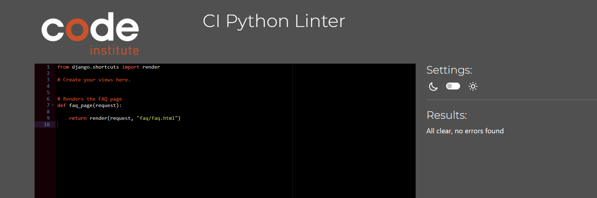

## Testing

Throughout the development of this project, extensive testing was carried out to ensure the website functions correctly. This section provides documentation on all tests performed.

### Code Validation
I validated all code using the appropriate tools for each language.

#### HTML
All HTML files were tested using the [W3C HTML Validator](https://validator.w3.org/) to ensure compliance with web standards.

| Home Page           |                      |
| ------------------- | ------------------------------------------------------------------------------------------- |
| All Products Page   |           |
| Product Detail Page |  |
| Contact Us Page     |                |
| Add Review Page     |               |
| Profile Page        |                |
| Shopping Bag        |           |
| Wishlist            |                   |
| Faq Page            |                             |
| Privacy Policy      |       |

#### CSS
The recommended [CSS Jigsaw Validator](https://jigsaw.w3.org/css-validator/) is used to validate all of my CSS files.

| File         | Screenshot                                                                         |
| ------------ | ---------------------------------------------------------------------------------- |
| style.css    |                 |
| profile.css  |    |
| checkout.css |  |

#### JavaScript
Used the recommended [JShint Validator](https://jshint.com/) to validate the JS files.

| File                  | Screenshot                                                                             |
| --------------------- | -------------------------------------------------------------------------------------- |
| add_product.js        |               |
| edit_product.js       |             |
| products_postload.js  |       |
| countryfield.js       |             |
| quantity_input_script |  |
| stripe-elements-js    |       |

#### Python
[CI Python Linter](https://pep8ci.herokuapp.com/) is used for validating all the Python files.

| Home Page                    | Screenshot                                                          |
| ------------------------------ | ------------------------------------------------------------------- |
| models.py                      |  |
| views.py                       |    |
| forms.py                       |    |

 

| Products | Screenshot                                                               |
| -------- | ------------------------------------------------------------------------ |
| models.py   |    |
| views.py    |      |
| forms.py    |      |
| urls.py     |        |
| widgets.py  |  |

 

| Contact | Screenshot                                                                 |
| ---------- | -------------------------------------------------------------------------- |
| models.py     |  |
| views.py      |    |
| forms.py      |    |
| urls.py       |      |

 

| Bag      | Screenshot                                                                |
| -------- | ------------------------------------------------------------------------- |
| contexts.py |  |
| views.py    |        |
| apps.py     |          |
| urls.py     |            |

 

| Checkout | Screenshot                                                                     |
| -------- | ------------------------------------------------------------------------------ |
| models.py   |          |
| views.py    |            |
| forms.py    |            |
| signals.py  |   |
| admin.py    |            |
| webhooks.py |  |
| urls.py     |         |

 

| Profiles | Screenshot                                                             |
| -------- | ---------------------------------------------------------------------- |
| models.py   |  |
| views.py    |    |
| forms.py    |    |

 

| Wishlist | Screenshot                                                             |
| -------- | ---------------------------------------------------------------------- |
| models.py   |  |
| views.py    |    |

 

| Faq   | Screenshot                                                 |
| ----- | ---------------------------------------------------------- |
| views.py |  |
| urls.py  |    |

