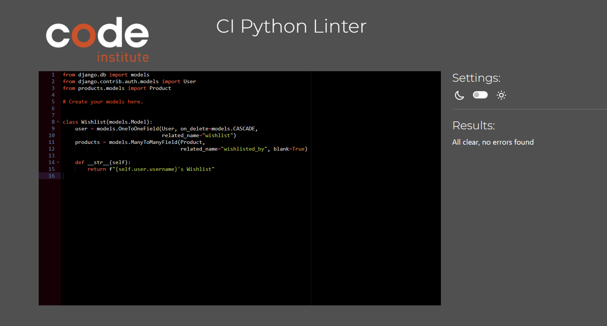
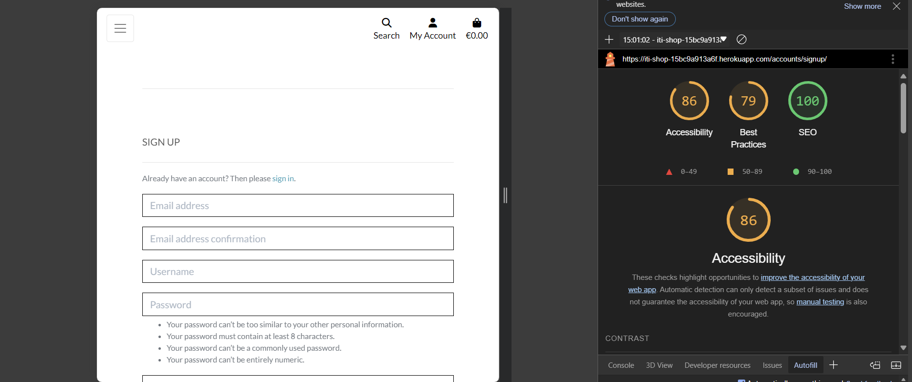

## Testing

Throughout the development of this project, extensive testing was carried out to ensure the website functions correctly. This section provides documentation on all tests performed.

### Code Validation
I validated all code using the appropriate tools for each language.

#### HTML
All HTML files were tested using the [W3C HTML Validator](https://validator.w3.org/) to ensure compliance with web standards.

| Home Page           |                      |
| ------------------- | ------------------------------------------------------------------------------------------- |
| All Products Page   |           |
| Product Detail Page |  |
| Contact Us Page     |                |
| Add Review Page     |               |
| Profile Page        |                |
| Shopping Bag        |           |
| Wishlist            |                   |
| Faq Page            |                             |
| Privacy Policy      |       |

#### CSS
The recommended [CSS Jigsaw Validator](https://jigsaw.w3.org/css-validator/) is used to validate all of my CSS files.

| File         | Screenshot                                                                         |
| ------------ | ---------------------------------------------------------------------------------- |
| style.css    |                 |
| profile.css  |    |
| checkout.css |  |

#### JavaScript
Used the recommended [JShint Validator](https://jshint.com/) to validate the JS files.

| File                  | Screenshot                                                                             |
| --------------------- | -------------------------------------------------------------------------------------- |
| add_product.js        |               |
| edit_product.js       |             |
| products_postload.js  |       |
| countryfield.js       |             |
| quantity_input_script |  |
| stripe-elements-js    |       |

#### Python
[CI Python Linter](https://pep8ci.herokuapp.com/) is used for validating all the Python files.

| Home Page                    | Screenshot                                                          |
| ------------------------------ | ------------------------------------------------------------------- |
| models.py                      |  |
| views.py                       |    |
| forms.py                       |    |

 

| Products | Screenshot                                                               |
| -------- | ------------------------------------------------------------------------ |
| models.py   |    |
| views.py    |      |
| forms.py    |      |
| urls.py     |        |
| widgets.py  |  |

 

| Contact | Screenshot                                                                 |
| ---------- | -------------------------------------------------------------------------- |
| models.py     |  |
| views.py      |    |
| forms.py      |    |
| urls.py       |      |

 

| Bag      | Screenshot                                                                |
| -------- | ------------------------------------------------------------------------- |
| contexts.py |  |
| views.py    |        |
| apps.py     |          |
| urls.py     |            |

 

| Checkout | Screenshot                                                                     |
| -------- | ------------------------------------------------------------------------------ |
| models.py   |          |
| views.py    |            |
| forms.py    |            |
| signals.py  |   |
| admin.py    |            |
| webhooks.py |  |
| urls.py     |         |

 

| Profiles | Screenshot                                                             |
| -------- | ---------------------------------------------------------------------- |
| models.py   |  |
| views.py    |    |
| forms.py    |    |

 

| Wishlist | Screenshot                                                             |
| -------- | ---------------------------------------------------------------------- |
| models.py   |  |
| views.py    |    |

 

| Faq   | Screenshot                                                 |
| ----- | ---------------------------------------------------------- |
| views.py |  |
| urls.py  |    |

## Manual Testing
Full testing of the functionality of the site was done on the following devices:

 * Laptop Used : Samsung Galaxy Book2 Pro 360 Notebook
 * Mobile : iPhone 11

The following browsers were used to test the functionality of the site.

Microsoft Edge , Safari

### Accessibility 

Tested through Lighthouse in Dev Tools.

| Page            | Screenshot                                                                                     |
| --------------- | ---------------------------------------------------------------------------------------------- |
| Home            |                  |
| All Products    |  |
| Product Details |  |
| Sign Up         |                 |
| Sign In         |                   |
| Sign Out        |                |
| Contact Us      |           |
| Faq             |                         |
| Privacy Policy  |    |
| Shopping Bag    |      |
| Checkout        |               |
| Profile         |                |

### Functionality

| Feature                         | Test Case                                                                                            | Expected Outcome                                                                                          | Actual Outcome       | Pass/Fail |
| ------------------------------- | ---------------------------------------------------------------------------------------------------- | --------------------------------------------------------------------------------------------------------- | -------------------- | --------- |
| **Home Page**                       |                                                                                                      |                                                                                                           |                      |           |
| Logo                            | Click on logo redirecting to home page                                                               | Logo should navigate back to the home page                                                                | Works as expected    | Pass      |
| "Shop Now" Button               | Click on "Shop Now" button redirecting to new arrivals                                               | "Shop Now" button should navigate to the new arrivals section                                             | Works as expected    | Pass      |
| Product Favorites               | Refresh the page to check if the products are displayed randomly                                  | Products should display randomly each time                                                                | Works as expected | Pass      |
| Random Products                 | Clicking on random product cards                                                                     | Random products should navigate to their corresponding detail product page                                | Works as expected    | Pass      |
| **Newsletter Sign Up**             |                                                                                                      |                                                                                                           |                      |           |
| Valid Email                     | Enter a valid email address and submit                                                               | Redirect to newsletter confirmation page, email confirmation sent                                         | Works as expected    | Pass      |
| Duplicate Email                 | Enter the same email address twice                                                                   | Displays an error message indicating email is already subscribed                                          | Works as expected    | Pass      |
| **All Products Page**               |                                                                                                      |                                                                                                           |                      |           |
| View All Products               | Navigate to the All Products page                                                                    | All products should be displayed correctly                                                                | Works as expected    | Pass      |
| View Products by Price          | Click on the "All Products" link in the navbar and go to 'By Price" option , 'choose low to high' | Displays products in ascending order of price, starting from the lowest and moving to the highest      | Works as expected | Pass      |
| View Products by Rating         | Click on the "All Products" link in the navbar and go to 'By Rating" option , 'high to low'       | Displays products in decending order of rating, starting from the highest and moving to the lowest     | Works as expected | Pass      |
| View Products by Category       | Click on the "All Products" link in the navbar and go to 'By Category" option , 'Name A-Z'        | Displays products in alphabetical order                                                                   | Works as expected | Pass      |
| **Clothing Page**                   |                                                                                                      |                                                                                                           |                      |           |
| Ladies                          | Click on the "Clothing" link in the navbar and go to 'Ladies" option                              | Displays all products wor Women                                                                           | Works as expected | Pass      |
| Gentleman                       | Click on the "Clothing" link in the navbar and go to "Gentlemen" option                           | Displays all products for Men                                                                             | Works as expected | Pass      |
| New Arrivals                    | Click on the "Clothing" link in the navbar and go to "New Arrivals" option                        | Displays all products marked as New Arrivals                                                              | Works as expected | Pass      |
| All Clothing                    | Click on the "Clothing" link in the navbar and go to "All Clothing" option                        | Displays all clothing products                                                                            | Works as expected | Pass      |
| **Sale Page**                       |                                                                                                      |                                                                                                           | Works as expected | Pass      |
| Sale Page                       | Click on the "Sale" link in the navbar                                                               | Displays all products with discounted price in red and old price is displayed with a strikethrough.       | Works as expected | Pass      |
| **Contact Us Form**                 |                                                                                                      |                                                                                                           |                      |           |
| Valid Input                     | Submit contact form with valid input                                                                 | Form should submit successfully, and an email should be sent to the user                                  | Works as expected    | Pass      |
| Invalid Input                   | Submit contact form with invalid input (e.g., empty required fields)                                 | Error message should be displayed indicating the invalid input                                            | Works as expected    | Pass      |
| **Detailed Product Page**           |                                                                                                      |                                                                                                           |                      |           |
| Product details                 | Click on Product image or name in Products page                                                      | Redirection to Product Detail page                                                                        | Works as expected    | Pass      |
|                                 | Click on Add to Wishlist                                                                             | Button disabled and text changed "In Wishlist"                                                            | Works as expected    | Pass      |
|                                 | Click on "View Materials" button                                                                     | The materials area is displayed                                                                           | Works as expected    | Pass      |
|                                 | Click + button on quantity selector form                                                             | The quantity increases if the number + 1 to 99                                                            | Works as expected    | Pass      |
|                                 | Click - button on quantity selector form                                                             | Quantity number decreases if current quantity is greater than one                                      | Works as expected    | Pass      |
| **Search Function**                 |                                                                                                      |                                                                                                           | Works as expected | Pass      |
| Search Functionality            | Enter a search term and view results                                                                 | Products matching the search term should display correctly                                                | Works as expected    | Pass      |
| Empty Search                    | No search term entered                                                                               | An error message should be displayed indicating no search criteria entered                                | Works as expected    | Pass      |
| **Add to Bag**                      |                                                                                                      |                                                                                                           |                      |           |
| Add Product to Bag              | Add a product to the shopping bag                                                                    | Product should be added to the bag                                                                        | Works as expected    | Pass      |
| Max Quantity in Bag             | Add more than 99 units of a product to the bag                                                       | An error message should appear, preventing the addition of more than 99 units                             | Works as expected    | Pass      |
| **Checkout Process**                |                                                                                                      |                                                                                                           |                      |           |
| Valid Checkout                  | Complete checkout with valid payment and shipping information                                        | Order should be successfully placed and confirmation email sent                                           | Works as expected    | Pass      |
| Invalid Checkout                | Attempt checkout with invalid payment or shipping information                                        | Error message should be displayed, preventing checkout completion                                         | Works as expected    | Pass      |
| **Add a Review**                    |                                                                                                      |                                                                                                           |                      |           |
| Add Review                      | Logged in user submits a review                                                                      | Review should be successfully added and displayed                                                         | Works as expected    | Pass      |
| Edit Review                     | Logged in user edits their review                                                                    | Review should be successfully updated and changes reflected                                               | Works as expected    | Pass      |
| Delete Review                   | Logged in user deletes their review                                                                  | Review should be successfully deleted                                                                     | Works as expected    | Pass      |
| Review as Guest                 | Non-logged-in user tries to add/edit/delete a review                                                 | User should be redirected to log in page, actions should not be allowed                                   | Works as expected    | Pass      |
| **Product Management (Admin Only)** |                                                                                                      |                                                                                                           |                      |           |
| Add Product                     | Admin user adds a new product                                                                        | Product should be successfully added to the product list                                                  | Works as expected    | Pass      |
| Edit Product                    | Admin user edits an existing product                                                                 | Product should be successfully updated                                                                    | Works as expected    | Pass      |
| Delete Product                  | Admin user deletes a product                                                                         | Product should be successfully removed from the store                                                     | Works as expected    | Pass      |
| Product Management as Guest     | Non-admin users attempt to add/edit/delete products                                                  | Access should be denied, and a relevant error message displayed                                           | Works as expected    | Pass      |
| **Wishlist Functionality**          |                                                                                                      |                                                                                                           |                      |           |
| Add to Wishlist                 | Logged-in user adds a product to wishlist                                                            | Product should be added, and the "Add to Wishlist" button disabled                                        | Works as expected    | Pass      |
| Remove from Wishlist            | Logged-in user removes a product from wishlist                                                       | Product should be removed, and wishlist should update correctly                                           | Works as expected    | Pass      |
| View Product from Wishlist      | Logged-in user clicks on button "View Product"                                                       | Redirection to Products detail page                                                                       | Works as expected    | Pass      |
| **Log Out Page**                    |                                                                                                      |                                                                                                           |                      |           |
|                                 | Click Logout button                                                                                  | Redirects user to logout page                                                                             | Works as expected    | Pass      |
|                                 | Click Confirm Logout button                                                                          | Redirects user to home page                                                                               | Works as expected    | Pass      |
| **Sign in Page**                    |                                                                                                      |                                                                                                           |                      |           |
|                                 | Click on the Login button under account on nav menu                                                  | Redirection to Login page                                                                                 | Works as expected    | Pass      |
|                                 | Enter valid email address                                                                            | Field will only accept email address format                                                               | Works as expected    | Pass      |
|                                 | Enter valid password                                                                                 | Field will only accept email correct password format                                                      | Works as expected    | Pass      |
| **Sign up Page**                    |                                                                                                      |                                                                                                           |                      |           |
|                                 | Click on Register button under account on nav menu                                                   | Redirection to Sign Up page                                                                               | Works as expected    | Pass      |
|                                 | Enter valid email address                                                                            | Field will only accept email address format                                                               | Works as expected    | Pass      |
|                                 | Enter valid password                                                                                 | Field will only accept email correct password format                                                      | Works as expected    | Pass      |
|                                 | Click Sign Up button on sign up page                                                                 | Sends confirmation email and informs user to check their email                                         | Works as expected    | Pass      |
|                                 | Click on the link in confirmation email                                                              | Redirects user to sign in page                                                                            | Works as expected    | Pass      |
| **Order Confirmation**              |                                                                                                      |                                                                                                           |                      |           |
| Order Confirmation Email        | Complete a valid order                                                                               | Order confirmation email should be sent to the user after purchase                                        | Works as expected    | Pass      |
| **Profile Page**                    |                                                                                                      |                                                                                                           |                      |           |
| View Past Orders                | Logged-in user navigates to profile page and views past orders                                       | Orders placed by the user should be listed, and clicking on them should show order details                | Works as expected    | Pass      |
| View Wishlist on Profile        | Logged-in user views wishlist on profile page                                                        | Wishlist should display all products added to wishlist and update correctly if products are added/removed | Works as expected    | Pass      |

## Bugs

| Issue                                                                                                        | Fix                                                                                                                                                                                                                        |
| ------------------------------------------------------------------------------------------------------------ | --------------------------------------------------------------------------------------------------------------------------------------------------------------------------------------------------------------------------- |
| Static files won't load                                                                                       | Added `STATIC` configuration in `settings.py`                                                                                                                                                                               |
| `Checkout.css` and `stripe_elements.js` not working                                                           | Rearranged the folders to be in the correct directory                                                                                                                                                                       |
| Order subtotal not showing, error rendering template ``                                   | The file was in the wrong directory, rearranged it, and fixed the issue                                                                                                                                                     |
| Changes in product model when adding Reviews, migrations not applied to Heroku DB, causing server error       | Applied migrations through Heroku bash, which resolved the issue                                                                                                                                                            |
| Footer showing the width of the main container instead of full width                                          | A `div` tag was not closed. Added the closing `div` tag before ``                                                                                                                                             |
| Stylesheet not updating on the deployed version                                                               | A hard refresh (Ctrl+F5) on the app resolved the issue. Source: [Stack Overflow](https://stackoverflow.com/questions/52682812/django-css-not-updating)                                                                                                                                              |
| `ModuleNotFoundError: No module named 'profilescrispy_forms'` when adding profiles app, error during migration | Fixed by adding a missing comma after 'products' in `settings.py`                                                                                                                                                           |
| Toast success not showing the item image in the bag when added                                                | Removed unnecessary `if` statements in the template that were blocking the display of the item image. Fixed by streamlining the template logic                                                                                |

### Unresolved Bugs
No known issues.